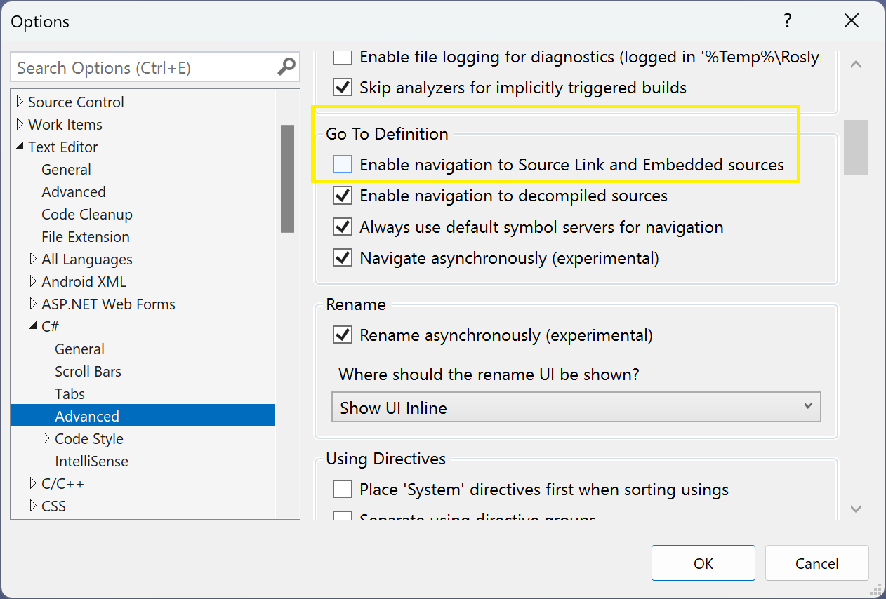

**Errata** (13 items)

If you find any mistakes, then please [raise an issue in this repository](https://github.com/markjprice/cs11dotnet7/issues) or email me at markjprice (at) gmail.com.

> Microsoft has changed their domain for documentation from `https://docs.microsoft.com` to `https://learn.microsoft.com` with an automatic redirect so all links in my books that use the `docs` domain should still work.

- [Page 4, 8 - Pros and cons of the .NET Interactive Notebooks extension, Downloading and installing Visual Studio Code](#page-4-8---pros-and-cons-of-the-net-interactive-notebooks-extension-downloading-and-installing-visual-studio-code)
- [Page 11 - Understanding the journey to one .NET and Understanding .NET support](#page-11---understanding-the-journey-to-one-net-and-understanding-net-support)
- [Page 37 - Getting definitions of types and their members](#page-37---getting-definitions-of-types-and-their-members)
- [Page 83 - Formatting using numbered positional arguments](#page-83---formatting-using-numbered-positional-arguments)
- [Page 85 - Getting text input from the user](#page-85---getting-text-input-from-the-user)
- [Page 86 - Getting text input from the user](#page-86---getting-text-input-from-the-user)
- [Page 185 - Creating a class library that needs testing](#page-185---creating-a-class-library-that-needs-testing)
- [Page 188 - Running unit tests using Visual Studio Code](#page-188---running-unit-tests-using-visual-studio-code)
- [Page 244 - Init-only properties](#page-244---init-only-properties)
- [Page 322 - Revealing the location of a type](#page-322---revealing-the-location-of-a-type)
- [Page 412 - Compressing streams](#page-412---compressing-streams)
- [Page 477 - Inserting entities](#page-477---inserting-entities)
- [Page 627 - Defining a typed view](#page-627---defining-a-typed-view)
- [Page 649 - Varying cached data by query string](#page-649---varying-cached-data-by-query-string)

# Page 4, 8 - Pros and cons of the .NET Interactive Notebooks extension, Downloading and installing Visual Studio Code

The **.NET Interactive Notebooks** extension has been renamed to **Polyglot Notebooks**. It still retains its original identifier `ms-dotnettools.dotnet-interactive-vscode`. The engine is still named *.NET Interactive*.

> Read more here: https://devblogs.microsoft.com/dotnet/dotnet-interactive-notebooks-is-now-polyglot-notebooks/#why-the-name-change

I wrote that "They cannot read input from the user, for example, you cannot use ReadLine or ReadKey." Although you cannot use the `Console` class methods, you can use the `Microsoft.DotNet.Interactive.Kernel` class and its `GetInputAsync` method. This uses the Visual Studio Code user interface to prompt the user for input.

# Page 11 - Understanding the journey to one .NET and Understanding .NET support

Even-numbered .NET releases like .NET 6 and .NET 8 have a support level named **Long Term Support (LTS)** with a duration of 3 years. Odd-numbered .NET releases like .NET 5 and .NET 7 had a support level named **Current** with a duration of 18 months. 

On June 6, 2022, the .NET team proposed to change the support level name from **Current** to [**Short Term Support (STS)**](https://github.com/dotnet/announcements/issues/223) to complement the existing **Long Term Support (LTS)**. I updated the drafts of my book to reflect that change.

On October 11, 2022, the .NET team changed the name again, to [**Standard Support**](https://devblogs.microsoft.com/dotnet/announcing-dotnet-7-rc-2/#support), probably because Microsoft Marketing decided that "short term" sounded too negative. My editors and I scrambled to update the final drafts of my book to reflect that change.

On October 28, 2022, the .NET team changed the name *again*, to [**Standard Term Support (STS)**](https://twitter.com/mairacw/status/1585789100879069185), probably because an initialism of **SS** is problematic and internal code and configuration was already using `sts`. Sadly, it was too late to update the PDFs that are sent to print.

*Sigh.* Such are the perils of trying to be up-to-date on release day.

# Page 37 - Getting definitions of types and their members

In Step 3, I wrote, "Click inside `int` and then right-click and choose **Go To Definition**." 

Visual Studio 2022 used to show code reverse-engineered **from metadata** for the selected type like `int` (see *Figure 1.1*), including the comments that I talk about in the book, but it now shows **Source Link** code (see *Figure 1.2*) which does not have comments.


*Figure 1.1: Go To Definition file tab generated from metadata*


*Figure 1.2: Go To Definition file tab retrieved from embedded Source Link code*

To change back to the original Visual Studio 2022 behavior that is described in the book, please follow these steps:

1. In Visual Studio 2022, navigate to **Tools** | **Options**.
2. In the **Options** dialog, navigate to **Text Editor** | **C#** | **Advanced**.
3. In the **Go To Definition** section, clear the check box named **Enable navigation to Source Link and Embedded sources**, as shown in *Figure 1.3*.
4. Click **OK**.



*Figure 1.3: Disabling Source Link for the Go To Definition feature*

# Page 83 - Formatting using numbered positional arguments

At the end of the section, I say, "The `Write`, `WriteLine`, and `Format` methods can have up to four numbered arguments, named `arg0`, `arg1`, `arg2`, and `arg3`." 

But the methods can only have up to *three* named arguments. I should have said, "The `Write`, `WriteLine`, and `Format` methods can have up to three numbered arguments, named `arg0`, `arg1`, and `arg2`. If you need to pass more than three values, then you cannot name the arguments using `arg0` and so on, as shown in the following code:"

```cs
// Passing three values can use named arguments.
Console.WriteLine(
 format: "{0} {1} lived in {2}.", 
 arg0: "Roger", arg1: "Cevung", arg2: "Stockholm");

// Passing four or more values cannot use named arguments.
Console.WriteLine(
 "{0} {1} lived in {2} and worked in the {3} team at {4}.", 
 "Roger", "Cevung", "Stockholm", "Education", "Optimizely");
```

# Page 85 - Getting text input from the user

I wrote that a notebook "does not support reading input from the console using `Console.ReadLine()`." Although this is true, you can use the `Microsoft.DotNet.Interactive.Kernel` class and its `GetInputAsync` method instead. This uses the .NET Interactive integration with the Visual Studio Code user interface to prompt the user for input.

```cs
using Microsoft.DotNet.Interactive; // to use the Kernel class

string firstName = await Kernel.GetInputAsync("Type your first name: ");

string age = await Kernel.GetInputAsync("Type your age: ");

Console.WriteLine($"Hello {firstName}, you look good for {age}.");
```


# Page 86 - Getting text input from the user

In Step 3, I wrote, "For the `firstName` variable" when I should have written, "For the `age` variable".

# Page 185 - Creating a class library that needs testing

In the "If you are using Visual Studio Code" section, in Step 5, the command in the book is `dotnet new console` but it should have been `dotnet new classlib`.

# Page 188 - Running unit tests using Visual Studio Code

> Thanks to [kwatsonkairosmgt](https://github.com/kwatsonkairosmgt) for raising this [issue on 27 October 2022](https://github.com/markjprice/cs10dotnet6/issues/106).

In Step 1, the project name `CalculatorLibUnitTest` should be `CalculatorLibUnitTests`.

# Page 244 - Init-only properties

> Thanks to Bob Molloy for raising this issue via email.

In Step 1, I say to add a new file named `Records.cs` to the `PacktLibraryNetStandard2` project/folder. I should have said to the `PacktLibraryModern` project/folder.

# Page 322 - Revealing the location of a type

> Thanks to Bob Molloy for raising this issue via email.

In Steps 2 and 5, I say to "Navigate to the top of the code file and note the assembly filename..."

If you have Source Link enabled, then you will not see the filename. I recommend that you [disable Source Link](#page-37---getting-definitions-of-types-and-their-members).

If you have Source Link disabled, then to see the filename you must expand the collapsed region. You will then find the assembly filename within the region, as shown in the following code:
```cs
#region Assembly System.Runtime, Version=7.0.0.0, Culture=neutral, PublicKeyToken=b03f5f7f11d50a3a
// C:\Program Files\dotnet\packs\Microsoft.NETCore.App.Ref\7.0.0\ref\net7.0\System.Runtime.dll
#endregion
```

# Page 412 - Compressing streams

> Thanks to Bob Molloy for raising this issue via email.

In Step 2, the following statement enables interpolated strings unnecessarily:
```cs
WriteLine($"The compressed contents:");
```

It should be:
```cs
WriteLine("The compressed contents:");
```

# Page 477 - Inserting entities

> Thanks to [Chadwick Geyser](https://github.com/chadwickgeyser) for raising this [issue on 29 November 2022](https://github.com/markjprice/cs11dotnet7/issues/5).

In Step 4, the code statement to list the products uses an older version of the method signature that I removed before publishing that only allows a single `productId` to be highlighted, as shown in the following code:
```cs
ListProducts(productIdToHighlight: resultAdd.productId);
```
It should use the method signature that allows multiple `productIds` to be highlighted, as shown in the following code:
```cs
ListProducts(productIdsToHighlight: new[] { resultAdd.productId });
```

# Page 627 - Defining a typed view

> Thanks to [Chadwick Geyser](https://github.com/chadwickgeyser) for raising this [issue on 4 December 2022](https://github.com/markjprice/cs11dotnet7/issues/6).

In Step 3, the code in the book to render the carousel indicators has an incorrect attribute named `data-slide-to`, as shown in the following markup:
```xml
<li data-bs-target="#categories" data-slide-to="@c" 
    class="@currentItem"></li>
```

Should be `data-bs-slide-to`, as shown in the following markup:
```xml
<li data-bs-target="#categories" data-bs-slide-to="@c" 
    class="@currentItem"></li>
```

It was already correct in the GitHub copy of the code.

# Page 649 - Varying cached data by query string

> Thanks to [Chadwick Geyser](https://github.com/chadwickgeyser) for raising this [issue on 5 December 2022](https://github.com/markjprice/cs11dotnet7/issues/7).

In Step 1, when defining a policy for output caching, the statement uses the method `VaryByQuery`, as shown in the following code:
```cs
options.AddPolicy("views", p => p.VaryByQuery(""));
```

The method name changed in Release Candidate 2, as described [here](https://learn.microsoft.com/en-us/dotnet/core/compatibility/aspnet-core/7.0/output-caching-renames), so statement should be changed to use the new method `SetVaryByQuery`, as shown in the following code:
```cs
options.AddPolicy("views", p => p.SetVaryByQuery(""));
```
