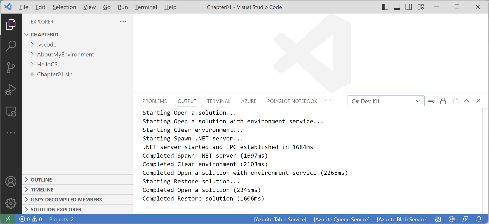
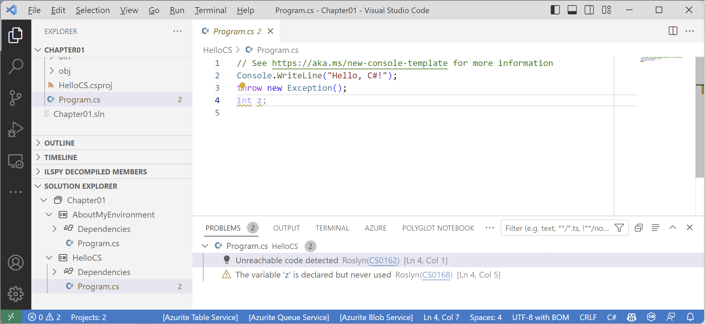
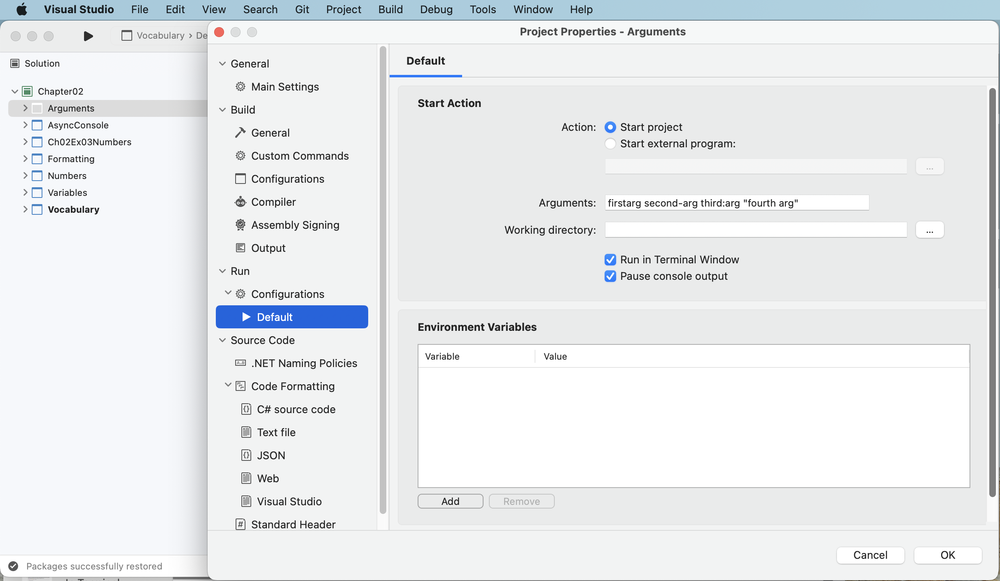

**Improvements** (42 items)

If you have suggestions for improvements, then please [raise an issue in this repository](https://github.com/markjprice/cs11dotnet7/issues) or email me at markjprice (at) gmail.com.

- [Page 8 - Installing other extensions](#page-8---installing-other-extensions)
- [Page 25 - Adding a second project using Visual Studio 2022](#page-25---adding-a-second-project-using-visual-studio-2022)
- [Page 31 - Adding a second project using Visual Studio Code](#page-31---adding-a-second-project-using-visual-studio-code)
- [Page 56 - Examples of statements and blocks](#page-56---examples-of-statements-and-blocks)
- [Page 69 - Raw interpolated string literals](#page-69---raw-interpolated-string-literals)
- [Page 86 - Getting text input from the user](#page-86---getting-text-input-from-the-user)
- [Page 91 - Passing arguments to a console app](#page-91---passing-arguments-to-a-console-app)
- [Page 128 - Rounding numbers](#page-128---rounding-numbers)
- [Page 146 - Understanding top-level programs and functions](#page-146---understanding-top-level-programs-and-functions)
- [Page 149 - Writing a times table function](#page-149---writing-a-times-table-function)
- [Page 153 - Writing a function that returns a value](#page-153---writing-a-function-that-returns-a-value)
- [Page 161 - Using lambdas in function implementations](#page-161---using-lambdas-in-function-implementations)
- [Page 163 - Using the Visual Studio Code integrated terminal during debugging](#page-163---using-the-visual-studio-code-integrated-terminal-during-debugging)
- [Page 179 - Reviewing project packages](#page-179---reviewing-project-packages)
- [Page 200 - Talking about OOP](#page-200---talking-about-oop)
- [Page 235 - More about methods](#page-235---more-about-methods)
- [Page 237 - Implementing functionality using methods](#page-237---implementing-functionality-using-methods)
- [Page 238 - Implementing functionality using methods](#page-238---implementing-functionality-using-methods)
- [Page 241 - Defining flight passengers](#page-241---defining-flight-passengers)
- [Page 251 - Setting up a class library and console application](#page-251---setting-up-a-class-library-and-console-application)
- [Page 254 - Calling methods using delegates](#page-254---calling-methods-using-delegates)
- [Page 270 - Equality of types](#page-270---equality-of-types)
- [Page 299 - Treating warnings as errors](#page-299---treating-warnings-as-errors)
- [Page 339 - Viewing source links with Visual Studio 2022](#page-339---viewing-source-links-with-visual-studio-2022)
- [Page 343 - Packaging a library for NuGet](#page-343---packaging-a-library-for-nuget)
- [Page 351 - Using non-.NET Standard libraries](#page-351---using-non-net-standard-libraries)
- [Page 378 - Dictionaries](#page-378---dictionaries)
- [Page 444 - Connecting to a database](#page-444---connecting-to-a-database)
- [Page 453 - Scaffolding models using an existing database](#page-453---scaffolding-models-using-an-existing-database)
- [Page 512 - Group-joining sequences](#page-512---group-joining-sequences)
- [Page 533 - Building websites using ASP.NET Core](#page-533---building-websites-using-aspnet-core)
- [Page 541 - Creating a class library for entity models using SQLite](#page-541---creating-a-class-library-for-entity-models-using-sqlite)
- [Page 547 - Creating a class library for a Northwind database context](#page-547---creating-a-class-library-for-a-northwind-database-context)
- [Page 550 - Creating a class library for entity models using SQL Server](#page-550---creating-a-class-library-for-entity-models-using-sql-server)
- [Page 551 - Creating a class library for entity models using SQL Server](#page-551---creating-a-class-library-for-entity-models-using-sql-server)
- [Page 573 - Adding code to a Razor Page](#page-573---adding-code-to-a-razor-page)
- [Page 586 - Creating a Razor class library, Page 587 - Implementing a partial view to show a single employee](#page-586---creating-a-razor-class-library-page-587---implementing-a-partial-view-to-show-a-single-employee)
- [Page 601 - Setting up an ASP.NET Core MVC website](#page-601---setting-up-an-aspnet-core-mvc-website)
- [Page 650 - Varying cached data by query string](#page-650---varying-cached-data-by-query-string)
- [Page 654 - Making controller action methods asynchronous](#page-654---making-controller-action-methods-asynchronous)
- [Page 655 - Exercise 14.2 – Practice implementing MVC by implementing a category detail page](#page-655---exercise-142--practice-implementing-mvc-by-implementing-a-category-detail-page)
- [Page 673 - Configuring the customer repository and Web API controller](#page-673---configuring-the-customer-repository-and-web-api-controller)
- [Page 700 - Exercise 15.2 – Practice creating and deleting customers with HttpClient](#page-700---exercise-152--practice-creating-and-deleting-customers-with-httpclient)

# Page 8 - Installing other extensions

In the next edition, I will tell the reader to install the **C# Dev Kit**. This has the **C#** extension as a dependency so that will be installed as well but it uses a newer version that is currently a pre-release. 

**C#** extension version `2.0` or later has removed OmniSharp and it has been replaced by a Language Server Protocol (LSP) Tools Host which integrates with open source components like Roslyn and Razor to provide rich type information and a faster, more reliable C# experience. 

The **C# Dev Kit** also adds a **Solution Explorer** to Visual Studio Code's **EXPLORER** view when you open a folder or project that contains a solution file (`.sln`).

In the next edition, I will therefore no longer need separate folder structures for Visual Studio 2022 and its `.sln` files, and Visual Studio Code and its `.code-workspace` files. I will just create a single unified folder structure. This does mean however that readers will need to be careful about switching between code editors. They will need to clean a solution (or manually delete the `bin` and `obj` folders) when they switch.

In the next edition, I will change the Visual Studio Code instructions to open a chapter folder, like `Chapter01`, and then use the **Solution Explorer** to work with the projects.

> Note: It will no longer necessary to use the **OmniSharp: Select Project** option. All projects in a recognized solution will have features like IntelliSense and debugging available.

# Page 25 - Adding a second project using Visual Studio 2022

> Thanks to [yoshist](https://github.com/yoshist) who raised this issue on [10 April 2023](https://github.com/markjprice/cs11dotnet7/issues/56).

In Step 6, I wrote, "In Solution Explorer, right-click the Chapter01 solution, select Set Startup Projects…, set 
Current selection, and then click OK." Then in Step 7, I wrote, "In Solution Explorer, click the AboutMyEnvironment project (or any file or folder within it), and note that Visual Studio indicates that AboutMyEnvironment is now the startup project by 
making the project name bold."

In the next edition, I will add a note to explicitly explain that I recommend this way of setting the startup project because it then makes it very easy to switch startup projects by simply clicking a project (or any file in a project) to make it the startup project. Although you can right-click a project and set it as a startup project, if you then want to run a different project, you must manually change it again. Simply clicking anywhere in the project is easier. 

# Page 31 - Adding a second project using Visual Studio Code

In Step 7, I wrote, "Enter `omni`, and then, in the drop-down list that appears, select **OmniSharp: Select Project**." 

This works if you installed the most recent release version `1.25.9`. But if you installed the pre-release version `2.0.x` then it does not include OmniSharp any more.

In the next edition, I will tell readers to install the **C# Dev Kit** which has some improvements that mean we can use the same solution files as Visual Studio 2022 and other tasks are simplified. So throughout the book I will rewrite the step-by-step instructions for Visual Studio Code users.

For example, it is no longer necessary to use the **OmniSharp: Select Project** option. All projects in a recognized solution will have features like IntelliSense and debugging available. To recognize a solution, we need to create a solution file. As an example, in Chapter 1, after the reader has created the two projects, I will rewrite the instructions to create a solution for them as follows:

1. At the command prompt or terminal, open the `Chapter01` folder.
2. Create a new solution file, as shown in the following command:
```
dotnet new sln
```
For example:
```
C:\cs12dotnet8\Chapter01>dotnet new sln
The template "Solution File" was created successfully.
```

3. Add the two subfolders and their projects to the solution file, as shown in the following command:
```
dotnet sln add HelloWorld AboutMyEnvironment
```
For example:
```
C:\cs12dotnet8\Chapter01>dotnet sln add HelloCS AboutMyEnvironment
Project `HelloCS\HelloCS.csproj` added to the solution.
Project `AboutMyEnvironment\AboutMyEnvironment.csproj` added to the solution.
```

4. In Visual Studio Code, open the `Chapter01` folder.
5. In **EXPLORER**, wait for the solution file to be recognized, as shown in the following figure:



6. Click **Solution Explorer** to expand it, as shown in the following figure:



# Page 56 - Examples of statements and blocks

> Thanks to [Nickolay Chistov](https://github.com/nchistov) who raised this issue on [19 April 2023](https://github.com/markjprice/cs9dotnet5/issues/30).

In the next edition, I will add a note to say, "I recommend that you follow the brace-style in Microsoft official documentation. For example, the for statement, as found at the following link:
https://learn.microsoft.com/en-us/dotnet/csharp/language-reference/statements/iteration-statements"
```cs
for (int i = 0; i < 3; i++)
{
    Console.Write(i);
}
```
The reason I use two spaces for indenting is because my code will be printed in a book and therefore has narrow width available.

The official coding style conventions are here:
https://learn.microsoft.com/en-us/dotnet/csharp/fundamentals/coding-style/coding-conventions

But regardless of any official guidelines, I recommend that you conform to whatever standards have been adopted by your development team, unless you are a solo developer in which case as long as your code compiles you can use any conventions you like.

# Page 69 - Raw interpolated string literals

> Thanks to [Mahdi Jaberzadeh Ansari](https://github.com/mjza) who raised this issue on [6 March 2023](https://github.com/markjprice/cs11dotnet7/issues/36).

In the example JSON used to illustrate a raw interpolated string literal, the comma after `"calculation"` should be a colon. Since we never use the JSON, it doesn't actually matter, but it would definitely be better as valid JSON, as shown in the following code: 
```cs
var person = new { FirstName = "Alice", Age = 56 };

string json = $$"""
              {
                "first_name": "{{person.FirstName}}",
                "age": {{person.Age}},
                "calculation": {{{ 1 + 2 }}}"
              }
              """;

Console.WriteLine(json);
```
And therefore the output should be:
```
{
 "first_name": "Alice",
 "age": 56,
 "calculation": "{3}"
}
```

# Page 86 - Getting text input from the user

In Step 1, I note that the `ReadLine` method is declared to return `string?`, meaning that it could return a `null` value instead of a `string` value (including an empty one). I also note that this is treated as a warning by the compiler. 

In the next edition, I will add a note to explain that this method never actually returns `null` so there is no point in checking for that in functional code. A more useful check is `string.IsNullOrEmpty` so I will add more steps to show how to use that method and `string.IsNullOrWhiteSpace` to validate text input. 

# Page 91 - Passing arguments to a console app

> Thanks to `MINIMA#8536` for raising this issue in the Discord channel for this book.

I give instructions for Visual Studio 2022 for Windows and Visual Studio Code. A few readers use Visual Studio 2022 for Mac but it is different to Visual Studio 2022 for Windows.

In the next edition, I will add steps for Visual Studio 2022 for Mac:

1. In Visual Studio for Mac, right-click the `Arguments` project.
2. In the popup menu, select **Properties**. 
3. In the **Project Properties - Arguments** dialog box, in the left-hand navigation section, select **Run** | **Configurations** | **Default**.
4. In the **Arguments** box, enter the arguments: `firstarg second-arg third:arg "fourth arg"`, as shown in the following screenshot.
5. Click **OK**.
6. Run the console app.



# Page 128 - Rounding numbers

In this section, I wrote about rounding rules as taught in schools and compare them to rounding rules when using C# and .NET. In schools, children are introduced to rounding rules with positive numbers and so learn the term "rounding up" and "rounding down". I did not explicitly say that for negative numbers, those terms would be reversed which can be confusing, so those terms should be avoided. This is why the .NET API uses the enum values `AwayFromZero`, `ToZero`, `ToEven`, `ToPositiveInfinity` and `ToNegativeInfinity` for improved clarity. In the next edition I will add a note about this.

# Page 146 - Understanding top-level programs and functions

> Thanks to **bfdhud** in the Discord channel (and a few others who had similar issues) for raising this issue.

Pages 146 and 147 explain how the top-level program feature works in detail. But what I do not explicitly highlight is that the auto-generated `Program` class is defined *without a namespace*. This is why, when extending the partial class by explicitly defining your own `partial Program` class in a separate file, you must NOT define a namespace for your class! 

For example, on page 147, note there is no `namespace` statement, as shown in the code below:
```cs
// in a file named Program.Functions.cs
partial class Program
{
  static void DoSomething() // define a non-local static function
  {
    WriteLine("Doing something!");
  }
}
```

In the next edition, I will highlight this, and add some code that will output the type's namespace so the reader can literally see that it is empty.

# Page 149 - Writing a times table function

In Step 4, in the `Program.Functions.cs` file, you are told to write the following code:
```cs
partial class Program
{
  static void TimesTable(byte number, byte size = 12)
  {
    WriteLine($"This is the {number} times table with {size} rows:");

    for (int row = 1; row <= size; row++)
    {
      WriteLine($"{row} x {number} = {row * number}");
    }
    WriteLine();
  }
}
```

If you use Visual Studio 2022 to create the `Program.Functions.cs` file from the **Class** project item template, then it wraps the class definition in a namespace (and imports some unnecessary namespaces), for example:
```cs
using System;
using System.Collections.Generic;
using System.Linq;
using System.Text;
using System.Threading.Tasks;

namespace WritingFunctions
{
  internal class Program
  {
  }
}
```
The namespace used by the `Program` class generated for the `Program.cs` file does not have a namespace (literally uses the `null` value for the name of its namespace), so the two `Program` classes never merge together as two `partial` definitions of a single class. 

You must delete the namespace declaration so that the `partial Program` class in the `Program.Functions.cs` file is in the same `null` namespace. 

In the next edition I will add a note explaining this, and I will change the Step 4 text to read: "In `Program.Functions.cs`, replace any existing code with new statements to define a function named `TimesTable` in the `partial Program` class, ..."

You can output the namespace of the `Program` class by getting the `Program` type information and checking if its `Namespace` property is `null`, as shown in the following code:
```cs
WriteLine($"typeof(Program).Namespace: {typeof(Program).Namespace ?? "null"}");
```

# Page 153 - Writing a function that returns a value

At the end of this section there is a note box that explains that we could use the `C` format code to format the output as currency. If you are running on a computer in a culture that uses Euros then to show the Euro currency symbol you must enable UTF-8 encoding. 

Add the following statement near the top of the code file before doing any writing to the console:

```cs
Console.OutputEncoding = System.Text.Encoding.UTF8;
```

# Page 161 - Using lambdas in function implementations

> Thanks to [Masoud Nazari](https://github.com/MAS-OUD) for raising this [issue on 8 March 2023](https://github.com/markjprice/cs11dotnet7/issues/39).

In the next edition, I will expand on the definition of **Immutability** e.g. a data value that cannot change. I will also note that C# `record` types are not necessarily immutable.

# Page 163 - Using the Visual Studio Code integrated terminal during debugging

I will copy the **Good Practice** note on page 167 to page 163 between Steps 1 and 2 so that readers without a `.vscode` folder will remember how to trigger Visual Studio Code to create it. This process is also covered in Chapter 1 but many readers will have forgotten.

# Page 179 - Reviewing project packages

In Step 1, the instruct the reader to add references to four packages, as shown in the following markup:
```xml
<ItemGroup>
  <PackageReference
    Include="Microsoft.Extensions.Configuration"
    Version="7.0.0" />
  <PackageReference
    Include="Microsoft.Extensions.Configuration.Binder"
    Version="7.0.0" />
  <PackageReference
    Include="Microsoft.Extensions.Configuration.FileExtensions"
    Version="7.0.0" />
  <PackageReference
    Include="Microsoft.Extensions.Configuration.Json"
    Version="7.0.0" />
 </ItemGroup>
```

Due to transitive dependencies, you only actually need to explicitly reference two of the packages, as shown in the following markup:
```xml
<ItemGroup>
  <PackageReference
    Include="Microsoft.Extensions.Configuration.Binder"
    Version="7.0.0" />
  <PackageReference
    Include="Microsoft.Extensions.Configuration.Json"
    Version="7.0.0" />
 </ItemGroup>
```

In Step 4, I tell Visual Studio 2022 readers to select the `appsettings.json` file and change its **Copy to Output Directory** to **Copy if newer**. To confirm this is done correctly, in the next edition, I will then tell them to review the change that was made to the project file, as shown in the following markup:
```xml
<ItemGroup>
  <None Update="appsettings.json">
    <CopyToOutputDirectory>PreserveNewest</CopyToOutputDirectory>
  </None>
</ItemGroup>
```

# Page 200 - Talking about OOP

In the next edition, I will add a summary table of the different categories of type and their capabilities, as well as several paragraphs of explanation. Parts of it might go at the start of Chapter 5 as an introduction but most of it is likely to go at the end of Chapter 6 as a review that brings together all the details from the two chapters.

|Type|Can be instantiated with `new`|Can be inherited from with `:`|Multiple inheritance|
|---|---|---|---|
|`class`|Yes|Yes|No|
|`sealed class`|Yes|No|No|
|`abstract class`|No|Yes|No|
|`interface`|No|Yes|Yes|
|`struct`|Yes|No|No|

For me, the terms *inherit* and *implement* are different, and in the early days of C# and .NET you could strictly apply them to classes and interfaces respectfully. *Inherit* implies some functionality that a sub class gets "for free" from its base aka super class. *Implement* implies some functionality that is NOT inherited but instead MUST be provided by the sub class. This is why **Chapter 6** is titled, **Implementing Interfaces and Inheriting Classes**.

Before C# 8, interfaces were always purely contracts i.e. there was no functionality that you could *inherit*. In those days, you could strictly use the term *implement* for an interface that represents a list of members that your type must implement, and *inherit* for classes with functionality that your type can inherit and potentially override. 

With C# 8, interfaces can now include default implementations, making them more like abstract classes, and the term *inherit* for an interface that has default implementations does make sense. But I feel uncomfortable with this capability as do many other .NET developers because it messes up what used to be a clean language design.

Classes can also have `abstract` members, for example, methods or properties without any implementation, just like an interface could have. When a sub class inherits from this class, they MUST provide an implementation of those abstract members. And the base class must be decorated with the `abstract` keyword to prevent it being instantiated using `new` because it is missing some functionality.

```cs
// To simplify the examples, I have left out access modifiers.
// Using "I" as a prefix for interfaces is a convention not a requirement.
// It is useful since only interfaces support multiple inheritance.

interface IAlpha { void M1(); } // These are both "classic" interfaces in that they are pure contracts.
interface IBeta { void M2(); } // No functionality, just the signatures of members that must be implemented.

// A type (in this example a struct) implementing an interface.
// ": IAlpha" means Gamma promises to implement all members of IAlpha.
// "void M1() { }" is that minimum implementation.
struct Gamma : IAlpha { void M1() { } } 

// A type (in this example a class) implementing two interfaces.
class Delta : IAlpha, IBeta { void M1() { } void M2() { } } 

// A sub class inheriting from a base aka super class.
// ": Delta" means inherit all members from Delta.
class Episilon : Delta { } 

// A class with one inheritable method and one abstract method that must be implemented in sub classes.
// A class with at least one abstract member must be decorated with the abstract keyword to prevent instantiation.
abstract class Zeta { void M3() { } abstract void M4(); }

// A class inheriting the M3 method but must provide an implementation for M4.
class Eta : Zeta { void M4() { } }

// In C# 8 and later, interfaces can have default implementatations as well as members that must be implemented.
interface ITheta { void M3() { } void M4(); }

// A class inheriting the default implementation from an interface and must provide an implementation for M4.
class Iota : ITheta { void M4() { } }
```

# Page 235 - More about methods

> Thanks to [cgwid](https://github.com/cgwid) for raising this [issue on 12 April 2023](https://github.com/markjprice/cs11dotnet7/issues/59).

In this section, we define some methods and operators so that two `Person` objects can get married and have babies. The example we model comes from the Bible story of Lamech and his two wives and their children. But the code I tell you to write does not allow Lamech to marry two women so later an exception is thrown when Lamech and his second wife try to make a baby. 

cgwid suggested a solution in [the issue they raised](https://github.com/markjprice/cs11dotnet7/issues/59). 

Here is my possible improvement. I might change it before using it in the next edition. We could use a `List<Person>` to store the zero, one or more people that a `Person` is married too. We could implement `Married` as a readonly property that calls the LINQ `Any` method to return `true` if there are any items in the `Spouses` list, as shown in the following code:
```cs
// Is this person married to anyone?
public bool Married => Spouses.Any();

// Allow multiple spouses.
public List<Person> Spouses = new();
```

Then we can implement the `static Marry` method by checking if the person is already in the list and then adding them if they are not, as shown in the following code:
```cs
// static method to marry
public static void Marry(Person p1, Person p2)
{
  if (p1.Spouses.Contains(p2) || p2.Spouses.Contains(p1))
  {
    throw new ArgumentException(
      string.Format("{0} is already married to {1}.",
      arg0: p1.Name, arg1: p2.Name));
  }
  else
  {
    p1.Spouses.Add(p2);
    p2.Spouses.Add(p1);
  }
}

// instance method to marry
public void Marry(Person partner)
{
  Marry(this, partner);
}
```

For convenience, we could create a method to output the number of and names of spouses of the current person, as shown in the following code:
```cs
public void OutputSpouses()
{
  if (Married)
  {
    string term = Spouses.Count == 1 ? "person" : "people";
    WriteLine($"{Name} is married to {Spouses.Count} {term}:");
    foreach (Person spouse in Spouses)
    {
      WriteLine($"  {spouse.Name}");
    }
  }
  else
  {
    WriteLine($"{Name} is not married.");
  }
}
```

We would also need to change the `Procreate` method to check that the two people are married before allowing them to make a baby, as shown in the following code:
```cs
// static method to "multiply"
public static Person Procreate(Person p1, Person p2)
{
  if (!p1.Spouses.Contains(p2))
  {
    throw new ArgumentException(
      string.Format("{0} must be married to {1} to procreate with them.",
      arg0: p1.Name, arg1: p2.Name));
  }

  Person baby = new()
  {
    Name = $"Baby of {p1.Name} and {p2.Name}",
    DateOfBirth = DateTime.Now
  };

  p1.Children.Add(baby);
  p2.Children.Add(baby);

  return baby;
}
```

Finally, we can call the `OutputSpouses` method in `Program.cs`, as shown in the following code:
```cs
// Implementing functionality using methods
Person lamech = new() { Name = "Lamech" };
Person adah = new() { Name = "Adah" };
Person zillah = new() { Name = "Zillah" };

lamech.Marry(adah);
// Person.Marry(zillah, lamech);

if (zillah + lamech)
{
  WriteLine($"{zillah.Name} and {lamech.Name} successfully got married.");
}
else
{
  WriteLine($"{zillah.Name} and {lamech.Name} failed to marry.");
}

lamech.OutputSpouses();
adah.OutputSpouses();
zillah.OutputSpouses();
```

The output should look like this:
```
Zillah and Lamech successfully got married.
Lamech is married to 2 people:
  Adah
  Zillah
Adah is married to 1 person:
  Lamech
Zillah is married to 1 person:
  Lamech
```

# Page 237 - Implementing functionality using methods

> Thanks to [Masoud Nazari](https://github.com/MAS-OUD) for raising this [issue on 5 March 2023](https://github.com/markjprice/cs11dotnet7/issues/35).

In Step 4, I tell the reader to write some code that uses the `??` operator. But I do not explain how this operator works until later in the book, on page 282, as shown in the following text and code example:

"Sometimes, you want to either assign a variable to a result or use an alternative value, such as `3`, if the 
variable is `null`. You do this using the **null-coalescing operator**, `??`, as shown in the following code:
```cs
// result will be 3 if authorName?.Length is null 
int result = authorName?.Length ?? 3; 
Console.WriteLine(result);
```

In the 8th edition, I will add a similar explanation of the operator `??` to the **Chapter 3, Operating on variables** section.

# Page 238 - Implementing functionality using methods

In Step 4, you write a `for` statement that enumerates the children of a `Person` object named `lamech`, as shown in the following code:
```cs
for (int i = 0; i < lamech.Children.Count; i++)
{
  WriteLine(format: "{0}'s child #{1} is named \"{2}\".",
    arg0: lamech.Name, arg1: i, arg2: lamech[i].Name);
}
```

Previously on page 233 you define an indexer for the `Person` class that accepts an integer parameter, as shown in the following code:
```cs
// indexers
public Person this[int index]
{
  get
  {
    return Children[index]; // pass on to the List<T> indexer
  }
  set
  {
    Children[index] = value;
  }
}
```

If you do not define the indexer, then you cannot use it in the `for` statement, and you will see the following compile error:
```
Error	CS0021	Cannot apply indexing with [] to an expression of type 'Person'
```

In the next edition, I will add a comment in the `for` statement to warn the reader that use of the indexer requires that the indexer be defined, and to offer an alternative if it has not been defined, as shown in the following code:
```cs
for (int i = 0; i < lamech.Children.Count; i++)
{
  WriteLine(format: "{0}'s child #{1} is named \"{2}\".",
    arg0: lamech.Name, arg1: i, 
    // The following requires an indexer to be defined for Person.
    // You should have done that in the previous section.
    // Alternatively, use lamech.Children[i].Name instead.
    arg2: lamech[i].Name);
}
```

# Page 241 - Defining flight passengers

> Thanks to [Masoud Nazari](https://github.com/MAS-OUD) for raising this [issue on 8 March 2023](https://github.com/markjprice/cs11dotnet7/issues/38).

In Step 1, you are told to add a new file named `FlightPatterns.cs`. If you use Visual Studio 2022, then this file will contain a class named `FlightPatterns`. 

In Step 2, you are given the complete code for that file that defines a file-scoped namespace named `Packt.Shared` with several classes like `Passenger` in it. If you define those classes inside the Visual Studio-generated `FlightPatterns` class then you will later have problems referencing the nested classes. 

In the next edition, I will add a note for Visual Studio readers to explicitly tell them to delete the class named `FlightPatterns` as well as providing the complete code for the `FlightPatterns.cs` file.

# Page 251 - Setting up a class library and console application

In Step 8, I wrote, "Run the `PeopleApp` project". 

In Chapter 1, I explain how to control which project starts when a Visual Studio 2022 solution contains multiple projects by setting the startup project. In Chapters 2 to 5, I remind the reader to set the startup project. 

In the 8th edition, I will add the same reminder to Chapter 6 as well, for example:

8. Set the `PeopleApp` project as the startup/active project:
    a) If you are using Visual Studio 2022, set the startup project for the solution to the current selection.
    b) If you are using Visual Studio Code, select `PeopleApp` as the active OmniSharp project. When you see the pop-up warning 
message saying that required assets are missing, click Yes to add them.
9. Run the `PeopleApp` project and note the result, as shown in the following output:
```
Harry was born on a Sunday.
```

# Page 254 - Calling methods using delegates

> Thanks to `Jovis#7721` in the Discord channel for raising this issue.

This section shows example code that defines a method and a matching delegate. This code is not meant to be entered into your existing project. The reason is because you cannot just declare a type (like a class, or a delegate as in this example) in the middle of a top-level program. 

A delegate declaration, as shown in the following code:
```cs
delegate int DelegateWithMatchingSignature(string s);
```

Will give the following compile error:
```
CS8803: Top-level statements must precede namespace and type declarations.
```

If you try to enter it before the following code in `Program.cs`:

```cs
// create a delegate instance that points to the method
DelegateWithMatchingSignature d = new(p1.MethodIWantToCall);

// call the delegate, who then calls the method
int answer2 = d("Frog");
```

In the next edition, I will add a note to warn the reader either not to enter this code, or to tell them to put at the bottom of `Program.cs` or in a separate file, as shown in the following code:
```cs
// In a separate file like Program.Delegates.cs.
delegate int DelegateWithMatchingSignature(string s);
```

# Page 270 - Equality of types

> Thanks to [Masoud Nazari](https://github.com/MAS-OUD) for raising this [issue on 17 March 2023](https://github.com/markjprice/cs11dotnet7/issues/44).

In Step 1, I tell the reader to write a statement to output the values of two integers and if they are equal, as shown in the following code:
```cs
WriteLine($"a == b: {(a == b)}");
```
It is not necessary to wrap the equality expression in parentheses like this: `(a == b)`. In more complex expressions it might be necessary to control the order of a calculation, and some developers prefer adding parentheses, but here it is not needed, and some code editors like Visual Studio 2022 will recommend that they are removed.

In the next edition, I will remove the parentheses, as shown in the following code:
```cs
WriteLine($"a == b: {a == b}");
```

I will do the same for the output statements in Steps 3, 5, and 7, as shown in the following code:
```cs
// Step 3 statement will become:
WriteLine($"p1 == p2: {p1 == p2}");

// Step 5 statement will become:
WriteLine($"p1 == p3: {p1 == p3}");

// Step 7 statement will become:
WriteLine($"p1.Name == p2.Name: {p1.Name == p2.Name}");
```

# Page 299 - Treating warnings as errors

This section shows how to follow best practice and treat warnings as errors. But doing so means you must write extra code in common scenarios to fix all warnings that will now be treated as errors that prevent compilation during the build process.

So this section also shows how to disable some common warnings by adding extra code. The project is NOT designed to be run. The code in it is written only to illustrate some common warnings and how to disable them to allow a build. 

For example, one warning is caused by the compiler thinking there could be a null dereference. To disable the warning, you therefore need to check for a `null` value *even though we know that can never actually happen* as explained in the note. That extra code check is pointless if you run the console app and expect it to work correctly. 

In the next edition, I will add another note to explicitly tell the reader not to run the project. The project implementation is not written to actually function as a check if someone has entered their name because that's not the point of this section. I will also simplify the code.

Current code:
```cs
if (name == null)
{
  Console.WriteLine("You did not enter a name.");
  return;
}
```
Code in next edition:
```cs
if (name == null) return; // must check for null to remove the warning
```

# Page 339 - Viewing source links with Visual Studio 2022

> Thanks to [Masoud Nazari](https://github.com/MAS-OUD) for raising this [issue on 24 March 2023](https://github.com/markjprice/cs11dotnet7/issues/48).

In Step 3, I wrote, "Right-click in the `Count` method and select **Go To Implementation**."

What happens next depends on a Visual Studio option that the reader can control. This is explained in the following item:
https://github.com/markjprice/cs11dotnet7/blob/main/docs/errata/errata.md#page-37---getting-definitions-of-types-and-their-members

In the next edition, I will add a note to remind readers about this. I will also add the explantion in the errata item above to Chapter 1 when the feature is first introduced.

# Page 343 - Packaging a library for NuGet

In Step 3, you modify `SharedLibrary.csproj` to add some elements to control how the class library is turned into a NuGet package. If you rely on IntelliSense then it could mislead you to use deprecated tag names. For example, `<PackageIconUrl>` is deprecated in favor of `<PackageIcon>`.

In the next edition, I will add a warning about this and include a reference to the documentation. The tag names are documented in the **MSBuild Property** column in the table found at the following link:

https://learn.microsoft.com/en-us/nuget/reference/msbuild-targets#pack-target

# Page 351 - Using non-.NET Standard libraries

> Thanks to [Masoud Nazari](https://github.com/MAS-OUD) for raising this [issue on 24 March 2023](https://github.com/markjprice/cs11dotnet7/issues/49).

In Step 4, the code sets the `Label` of instances of `Axis` and `Matrix<T>` using the concatenate operator `+`, as shown in the following code:
```cs
for (int i = 0; i < matrix.Axes[0].Points.Length; i++)
{
  matrix.Axes[0].Points[i].Label = "x" + i.ToString();
}

for (int i = 0; i < matrix.Axes[1].Points.Length; i++)
{
  matrix.Axes[1].Points[i].Label = "y" + i.ToString();
}
```

It would be an improvement if the expressions used interpolated strings, as shown in the following code:
```cs
for (int i = 0; i < matrix.Axes[0].Points.Length; i++)
{
  matrix.Axes[0].Points[i].Label = $"x{i}";
}

for (int i = 0; i < matrix.Axes[1].Points.Length; i++)
{
  matrix.Axes[1].Points[i].Label = $"y{i}";
}
```

# Page 378 - Dictionaries

In the next edition, I will add a note at the bottom of this section to set an expectation that readers will come across dictionaries again later in the book in more practical ways.

> Note: In Chapter 11, LINQ, you will learn how to create dictionaries and lookups from existing data sources like tables in a database using LINQ methods like `ToDictionary` and `ToLookup`. This is a much more common use than manually adding items to a dictionary as shown in this section.

# Page 444 - Connecting to a database

I wrote, "To connect to a SQLite database, we just need to know the database filename, set using the parameter `Filename`." 

In the next edition I will change this to, "To connect to a SQLite database, we just need to know the path to the database, set using the modern parameter named `Data Source` or the legacy parameter named `Filename`. The path can be relative to the current directory or an absolute path."

Throughout the rest of the book, I will replace the `Filename` parameter with `Data Source` for consistency with modern parameters. For example on pages 445, 453, 456, 464, 504, 541, and 547.

# Page 453 - Scaffolding models using an existing database

There are two potential issues on this page.

First, in Step 2, I show text that must be entered as a single line at the command prompt or terminal, as shown in the following command formatted as in the print book:
```
dotnet ef dbcontext scaffold "Filename=Northwind.db" Microsoft.
EntityFrameworkCore.Sqlite --table Categories --table Products --output-
dir AutoGenModels --namespace WorkingWithEFCore.AutoGen --data-
annotations --context Northwind
```

I recommend that you type from the print book or copy and paste long commands like this from the eBook into a plain text editor like Notepad. Then make sure that the whole command is properly formatted as a single line with correct spacing, before you then copy and paste it to the command-line. Copying and pasting directly from the eBook is likely to include newline characters and missing spaces and so on that break the command.

For convenience, here is the same command as a single line to make it easier to copy and paste:
```
dotnet ef dbcontext scaffold "Filename=Northwind.db" Microsoft.EntityFrameworkCore.Sqlite --table Categories --table Products --output-dir AutoGenModels --namespace WorkingWithEFCore.AutoGen --data-annotations --context Northwind
```

Second, I tell the reader to enter the preceding command in the `WorkingWithEFCore` folder. If you have created the project file named `WorkingWithEFCore.csproj` in that folder as directed then every works. But if that folder does not contain your project file then you will see the following error:
```
No project was found. Change the current working directory or use the --project option.
```

To fix this issue, change to the folder that contains your `WorkingWithEFCore.csproj` project file and then run the command. Alternatively, you can specific the path to the `WorkingWithEFCore.csproj` project file using the `--project` switch.

In the 8th edition, I will add a note about this.

# Page 512 - Group-joining sequences

> Thanks to Amer Cejudo who raised this issue via email.

After this section, I will add a new section titled **Grouping for lookups**. It will cover the `ToLookup` method that I later use in a solution to an exercise but never cover in the book itself!

Imagine that you have a table named `Customers` in a database that includes a column for the country they reside in, as shown in the following table:

|CompanyName|Country|
|---|---|
|Alfreds Futterkiste|Germany|
|Blauer See Delikatessen|Germany|
|Great Lakes Food Market|USA|
|Hungry Coyote Import Store|USA|
|Lazy K Kountry Store|USA|

You might want to create a data structure in memory that can group the `Customer` objects by their country, and provide a quick way to look up all the customers in a specific country. You can create this using the `ToLookup` LINQ method, as shown in the following code:
```cs
ILookup<string?, Customer>? customersByCountry = db.Customers.ToLookup(c => c.Country);
```
This creates a dictionary-like data structure in memory that has unique country names for the key and a collection of `Customer` objects for the value, as shown in the following table:

|Key|Value (collection of Customers)|
|---|---|
|Germany| [Alfreds Futterkiste] [Blauer See Delikatessen]|
|USA|[Great Lakes Food Market] [Hungry Coyote Import Store] [Lazy K Kountry Store]|

> Note the company names in square brackets like [Alfreds Futterkiste] represent an entire `Customer` object stored in a collection.

We can then lookup an individual collection of customers for a specific country, as shown in the following code:
```cs
IEnumerable<Customer> customersInGermany = customersByCountry["Germany"];

foreach (Customer customer in customersInGermany)
{
  WriteLine(customer.CompanyName);
}
```

Or we can enumerate through the whole lookup, using an `IGrouping<string?, Customer>` to represent each *row* in the lookup dictionary, as shown in the following code:

```cs
foreach (IGrouping<string?, Customer> cbc in customersByCountry)
{
  WriteLine(cbc.Key); // Outputs: Germany, USA, and so on.
  
  foreach (Customer customer in cbc)
  {
    WriteLine(customer.CompanyName);
  }
}
```

# Page 533 - Building websites using ASP.NET Core

In this section, I introduce the various technologies like Razor Pages, MVC, and Blazor that are included with ASP.NET Core.

In the next edition, I will add a section with a table summarizing the file types used by these technologies because they are similar but different and if the reader does not understand some subtle but important differences, it can cause much confusion when trying to implement their own projects.

|Technology|Special filename|File extension|Directive|
|---|---|---|---|
|Razor Component (for Blazor)||`.razor`|None|
|Razor Component (for Blazor with page routing)||`.razor`|`@page`|
|Razor Page||`.cshtml`|`@page`|
|Razor View (for MVC)||`.cshtml`|None|
|Razor Layout||`.cshtml`|None|
|Razor View Start|`_ViewStart`|`.cshtml`|None|
|Razor View Imports|`_ViewImports`|`.cshtml`|None|

A **Razor Layout** file like `_MyCustomLayout.cshtml` is identical to a **Razor View**. What makes it a layout is being set as the `Layout` property of another Razor file, as shown in the following code:
```cs
@{
  Layout = "_MyCustomLayout";
}
```

> **Warning!** Be careful to use the correct file extension and directive at the top of the file or you will get unexpected behavior.

> **Convention**: The naming convention for special and shared Razor files like layouts and partial views is to prefix with an underscore `_`. For example, `_ViewStart.cshtml`, `_Layout.cshtml`, or `_Product.cshtml` (a partial view for rendering a product).


# Page 541 - Creating a class library for entity models using SQLite

In Step 9, you enter a `dotnet-ef` command. You must be in the project folder containing the `.csproj` file or you will see the following error:
```
No project was found. Change the current working directory or use the --project option.
```

In the 8th edition, I will add a note about this.

# Page 547 - Creating a class library for a Northwind database context

In Step 8, you write code to implement the `OnConfiguring` method so that it sets the Filename path to the SQLite database file correctly when running in both Visual Studio 2022 and at the command-line with Visual Studio Code, as shown in the following code:
```cs
protected override void OnConfiguring(DbContextOptionsBuilder optionsBuilder)
{
  if (!optionsBuilder.IsConfigured)
  {
    string dir = Environment.CurrentDirectory;
    string path = string.Empty;

    if (dir.EndsWith("net7.0"))
    {
      // Running in the <project>\bin\<Debug|Release>\net7.0 directory.
      path = Path.Combine("..", "..", "..", "..", "Northwind.db");
    }
    else
    {
      // Running in the <project> directory.
      path = Path.Combine("..", "Northwind.db");
    }

    optionsBuilder.UseSqlite($"Filename={path}");
  }
}
```

In the next edition, it will be improved in two ways. First, by defining a string value once for the database name, and second, by checking that the database file exists and throwing an exception if it does not, as shown in the following code:
```cs
protected override void OnConfiguring(DbContextOptionsBuilder optionsBuilder)
{
  string databaseName = "Northwind.db";

  if (!optionsBuilder.IsConfigured)
  {
    string dir = Environment.CurrentDirectory;
    string path = string.Empty;

    if (dir.EndsWith("net7.0"))
    {
      // Running in the <project>\bin\<Debug|Release>\net7.0 directory.
      path = Path.Combine("..", "..", "..", "..", databaseName);
    }
    else
    {
      // Running in the <project> directory.
      path = Path.Combine("..", databaseName);
    }

    path = Path.GetFullPath(path); // Convert to absolute path.
    WriteLine($"Database path: {path}");

    if (!File.Exists(path))
    {
      throw new FileNotFoundException(
        message: $"{path} not found.", fileName: path);
    }

    optionsBuilder.UseSqlite($"Filename={path}");
  }
}
```

> After converting the relative path to an absolute path, you can set a breakpoint to more easily see where the database file is expected to be, or add a statement to log that path.

The throwing of the exception is important because if the database file is missing, then the SQLite database provider will create an empty database file, and so if you test connecting to it, it works! But if you query it then you will see an exception related to missing tables because it does not have any tables! 

On page 553, we write some unit tests for this class and for SQLite the first test seems to work even when the path is actually wrong due to this issue. By adding code to throw an exception if the database file is missing, this test will now correctly fail.

In Step 11, in the `NorthwindContextExtensions.cs` file, we should also use a dynamically constructed string for the `AddNorthwindContext` method, as shown in the following code:
```cs
public static IServiceCollection AddNorthwindContext(
  this IServiceCollection services, 
  string relativePath = "..", 
  string databaseName = "Northwind.db")
{
  string path = Path.Combine(relativePath, databaseName);
  path = Path.GetFullPath(path);
  WriteLine($"Database path: {path}");

  if (!File.Exists(path))
  {
    throw new FileNotFoundException(
      message: $"{path} not found.", fileName: path);
  }

  services.AddDbContext<NorthwindContext>(options =>
  {
    // Data Source is the modern equivalent of Filename.
    options.UseSqlite($"Data Source={path}");

    options.LogTo(WriteLine, // Console
      new[] { Microsoft.EntityFrameworkCore
        .Diagnostics.RelationalEventId.CommandExecuting });
  }), 
  // Register with a transient lifetime to avoid concurrency issues Blazor Server projects.
  contextLifetime: ServiceLifetime.Transient, optionsLifetime: ServiceLifetime.Transient);

  return services;
}
```

# Page 550 - Creating a class library for entity models using SQL Server

In Step 6, you enter a `dotnet-ef` command. You must be in the project folder containing the `.csproj` file or you will see the following error:
```
No project was found. Change the current working directory or use the --project option.
```

In the 8th edition, I will add a note about this.

# Page 551 - Creating a class library for entity models using SQL Server

In Step 14, I tell the reader, "In the `Northwind.Common.DataContext.SqlServer` project, in `NorthwindContext.cs`, remove 
the compiler warning about the connection string."

It would be an improvement to also replace the hard-coded string value used for the database connection string with a dynamically constructed string using the `SqlConnectionStringBuilder` class, as shown in the following code:
```cs
// At the top of the NorthwindContext.cs file.
using Microsoft.Data.SqlClient; // SqlConnectionStringBuilder
```
The `OnConfiguring` method:
```cs
protected override void OnConfiguring(DbContextOptionsBuilder optionsBuilder)
{
  if (!optionsBuilder.IsConfigured)
  {
    SqlConnectionStringBuilder builder = new();

    builder.DataSource = "."; // "ServerName\InstanceName" e.g. @".\sqlexpress"
    builder.InitialCatalog = "Northwind";
    builder.IntegratedSecurity = true;
    builder.TrustServerCertificate = true;
    builder.MultipleActiveResultSets = true;
    builder.ConnectTimeout = 3; // Because we want to fail fast. Default is 15 seconds.

    optionsBuilder.UseSqlServer(builder.ConnectionString);
  }
}

```

In Step 15, in the `NorthwindContextExtensions.cs` file, we should also use a dynamically constructed string using the `SqlConnectionStringBuilder` class, as shown in the following code:
```cs
// At the top of the NorthwindContextExtensions.cs file.
using Microsoft.Data.SqlClient; // SqlConnectionStringBuilder
```
The `AddNorthwindContext` method:
```cs
public static IServiceCollection AddNorthwindContext(
  this IServiceCollection services,
  string? connectionString = null)
{
  if (connectionString == null)
  {
    SqlConnectionStringBuilder builder = new();

    builder.DataSource = "."; // "ServerName\InstanceName" e.g. @".\sqlexpress"
    builder.InitialCatalog = "Northwind";
    builder.IntegratedSecurity = true;
    builder.TrustServerCertificate = true;
    builder.MultipleActiveResultSets = true;
    builder.ConnectTimeout = 3; // Because we want to fail fast. Default is 15 seconds.

    connectionString = builder.ConnectionString;
  }

  services.AddDbContext<NorthwindContext>(options =>
  {
    options.UseSqlServer(connectionString);

    options.LogTo(WriteLine, // Console
      new[] { Microsoft.EntityFrameworkCore
        .Diagnostics.RelationalEventId.CommandExecuting });
  }), 
  // Register with a transient lifetime to avoid concurrency issues Blazor Server projects.
  contextLifetime: ServiceLifetime.Transient, optionsLifetime: ServiceLifetime.Transient);

  return services;
}
```

# Page 573 - Adding code to a Razor Page

This section starts with a description of Razor Pages. The first bullet point says, "They require the `@page` directive at the top of the file."

In the next edition, I will add a warning, as shown in the following note:

> **Warning!** *Razor Pages* are different from *Razor Views* (used in ASP.NET Core MVC) but they share the same file extension `.cshtml`. When creating a *Razor View*, do NOT use the `@page` directive!

# Page 586 - Creating a Razor class library, Page 587 - Implementing a partial view to show a single employee

In these sections you create two files named `Employees.cshtml` and `_Employee.cshtml`. I think the order that these files are created and the similarity of their names can confuse some readers. I will start this section with more explanation about what the reader is about to do i.e. create a Razor Page and a partial view, and that the Razor Page will use the partial view.

To make it clearer how they are related, what they do, and what their names mean, in the next edition, I will tell the reader to create the partial view that shows a single employee first and keep its name as `_Employee.cshtml`. Then I will tell the reader to create the Razor Page that uses that partial view but name it `EmployeesList.cshtml`. 

# Page 601 - Setting up an ASP.NET Core MVC website

This section starts with a description of the three parts of MVC. For views, I wrote, "**Views**: Razor files, that is, `.cshtml` files, that render data in view models into HTML web pages. Blazor uses the `.razor` file extension, but do not confuse them with Razor files!"

In the next edition, I will improve this text and add a warning:

"**Views**: *Razor View* files, that is, `.cshtml` files, that render data in view models into HTML web pages. *Razor Views* are different from *Razor Pages* but they share the same file extension `.cshtml`. When creating a *Razor Page*, it must have the `@page` directive at the top of its file. When creating a *Razor View*, do NOT use the `@page` directive! If you do, the controller will not pass the model and it will be `null`, throwing a `NullReferenceException` when you try to access any of its members. Also note that Blazor uses the `.razor` file extension, but do not confuse them with *Razor View* or *Razor Page* files! To add even more confusion, Blazor can also use the `@page` directive to allow a Blazor component to act like a page!"

# Page 650 - Varying cached data by query string

At the end of this section, you will have enabled output caching for the default MVC route that ignores query string variants. This could be confusing if you forget this behavior.

In the next edition, at the end of this section I will add a step to disable the output caching, as shown in the following code:
```cs
app.MapControllerRoute(
    name: "default",
    pattern: "{controller=Home}/{action=Index}/{id?}");
// Comment out the following:
//  .CacheOutput("views");
```

# Page 654 - Making controller action methods asynchronous

In an earlier task, you imported the `Microsoft.EntityFrameworkCore` namespace so that you could use the `Include` extension method. In Step 1, I tell you to use the `ToListAsync` method to implement the `Index` action method asynchronously. If you had not previously imported the `Microsoft.EntityFrameworkCore` namespace then you would have to import it now to use the `ToListAsync` method. 

In the next edition, I will add a comment to make this more obvious, as shown in the following code:

```cs
using Microsoft.EntityFrameworkCore; // To use the Include and ToListAsync extension methods.
```

# Page 655 - Exercise 14.2 – Practice implementing MVC by implementing a category detail page

Earlier in the chapter, and in Exercise 14.2, the link generated for a category detail page looks like this:
```
https://localhost:5001/category/1
```

Although it is possible to configure a route to respond to that format of link, it would be easier if the link used the following format:
```
https://localhost:5001/home/categorydetail/1
```

In `Index.cshtml`, change how the links are generated to match the improved format, as shown in the following markup:
```xml
<a class="btn btn-primary"
  href="/home/categorydetail/@Model.Categories[c].CategoryId">View</a>
```

This would then allow you to add an action method to the `HomeController` class as shown in the following code:
```cs
public async Task<IActionResult> CategoryDetail(int? id)
{
  if (!id.HasValue)
  {
    return BadRequest("You must pass a category ID in the route, for example, /Home/CategoryDetail/6");
  }

  Category? model = await db.Categories.Include(p => p.Products)
    .SingleOrDefaultAsync(p => p.CategoryId == id);

  if (model is null)
  {
    return NotFound($"CategoryId {id} not found.");
  }

  return View(model); // pass model to view and then return result
}
```

And create a view that matches the name `CategoryDetail.cshtml`, as shown in the following markup:
```xml
@model Packt.Shared.Category 
@{
  ViewData["Title"] = "Category Detail - " + Model.CategoryName;
}
<h2>Category Detail</h2>
<div>
  <dl class="dl-horizontal">
    <dt>Category Id</dt>
    <dd>@Model.CategoryId</dd>
    <dt>Product Name</dt>
    <dd>@Model.CategoryName</dd>
    <dt>Products</dt>
    <dd>@Model.Products.Count</dd>
    <dt>Description</dt>
    <dd>@Model.Description</dd>
  </dl>
</div>
```

> Note: You could also use the simpler link format `https://localhost:5001/home/category/1` but then both the action method and the view filename must be just `Category` instead of `CategoryDetail`.

If you want to keep the original link format, then you would need to decorate the action method as shown in the following code:
```cs
[Route("category/{id}")]
public async Task<IActionResult> CategoryDetail(int? id)
```

# Page 673 - Configuring the customer repository and Web API controller

In Step 4, you add a `CustomersController.cs` file and define a `CustomersController` class, as shown in the following partial code:
```cs
// base address: api/customers
[Route("api/[controller]")]
[ApiController]
public class CustomersController : ControllerBase
{
```

In the next edition, I will add more explanation about how the route is defined by the `[Route]` attribute. The `[controller]` part is automatically replaced with the class name with the `Controller` suffix removed. Therefore the base address of the route to the `CustomersController` is `api/customers`.

# Page 700 - Exercise 15.2 – Practice creating and deleting customers with HttpClient

In this exercise, you are tasked to "extend the `Northwind.Mvc` website project to have pages where a visitor can fill in a form to create a new customer, or search for a customer and then delete them. The MVC controller should make calls to the Northwind web service to create and delete customers." 

Without additional help and with no solution provided by me, it can be tricky for a new reader to complete this exercise.

I have now provided a possible solution and updated the GitHub repository with it. In the next edition, I will also provide some hints, similar to the following.

The project already has a page to show customers, either all of them or only those in a specified country. To avoid work, we will use this existing functionality. We just need to add a button in the `Customers.cshtml` view to **Add Customer**, a **Delete** button in a new column for each customer in the table, and areas to output success and errors messages, as shown in the following code:

**At the top of the Customers.cshtml Razor view**
```html
@if (TempData["error-message"] is not null)
{
  <p class="alert alert-danger">Error! @TempData["error-message"]</p>
}
@if (TempData["success-message"] is not null)
{
  <p class="alert alert-success">Congratulations! @TempData["success-message"]</p>
}

<a asp-controller="Home" asp-action="AddCustomer" 
   class="btn btn-outline-primary">Add Customer</a>
```

**In the table of customers, a blank header and a new column for delete buttons**
```html
<th></th>
```

```html
<td>
  <a asp-controller="Home"
     asp-action="DeleteCustomer" 
     asp-route-customerid="@c.CustomerId" 
     class="btn btn-outline-danger">Delete</a>
</td>
```

A common design pattern for implementing add and delete functionality in an ASP.NET Core MVC website is to define pairs of action methods, one that responds to a `GET` request and one that responds to a `POST` request.

For add functionality:
- `GET /Home/AddCustomer`: This request means show me a page with a blank form to enter information about a new customer.
- `POST /Home/AddCustomer`: This request means perform the actual customer insert using the form data provided in the body which is an entire customer.

For delete functionality:
- `GET /Home/DeleteCustomer/{ID}`: This request means show me a page with a form loaded with an existing customer record to confirm this is the customer the will be deleted.
- `POST /Home/DeleteCustomer`: This request means perform the actual customer delete using the form data provided in the body which only needs to be the unique `customerId`.

Here is some example code that would implement this functionality:
```cs
// GET /Home/AddCustomer
public IActionResult AddCustomer()
{
  ViewData["Title"] = "Add Customer";
  return View();
}

// POST /Home/AddCustomer
// A Customer object in the request body.
[HttpPost]
public async Task<IActionResult> AddCustomer(Customer customer)
{
  HttpClient client = clientFactory.CreateClient(
    name: "Northwind.WebApi");

  HttpResponseMessage response = await client.PostAsJsonAsync(
    requestUri: "api/customers", value: customer);

  // Optionally, get the created customer back as JSON
  // so the user can see the assigned ID, for example.
  Customer? model = await response.Content
    .ReadFromJsonAsync<Customer>();

  if (response.IsSuccessStatusCode)
  {
    TempData["success-message"] = "Customer successfully added.";
  }
  else
  {
    TempData["error-message"] = "Customer was NOT added.";
  }

  // Show the full customers list to see if it was added.
  return RedirectToAction("Customers");
}

// GET /Home/DeleteCustomer/{customerId}
public async Task<IActionResult> DeleteCustomer(string customerId)
{
  HttpClient client = clientFactory.CreateClient(
    name: "Northwind.WebApi");

  Customer? customer = await client.GetFromJsonAsync<Customer>(
    requestUri: $"api/customers/{customerId}");

  ViewData["Title"] = "Delete Customer";

  return View(customer);
}

// POST /Home/DeleteCustomer
// A CustomerId in the request body e.g. ALFKI.
[HttpPost]
[Route("home/deletecustomer")]
// Action method name must have a different name from the GET method
// due to C# not allowing duplicate method signatures.
public async Task<IActionResult> DeleteCustomerPost(string customerId)
{
  HttpClient client = clientFactory.CreateClient(
    name: "Northwind.WebApi");

  HttpResponseMessage response = await client.DeleteAsync(
    requestUri: $"api/customers/{customerId}");

  if (response.IsSuccessStatusCode)
  {
    TempData["success-message"] = "Customer successfully deleted.";
  }
  else
  {
    TempData["error-message"] = $"Customer {customerId} was NOT deleted.";
  }

  // Show the full customers list to see if it was deleted.
  return RedirectToAction("Customers");
}
```

**AddCustomer.cshtml Razor view**
```html
@using Packt.Shared
@model Customer

<h2>@ViewData["Title"]</h2>

<!--
  Show an editable form with a blank customer. Postback to the action
  method AddCustomer to perform the actual insert.
-->
<form asp-action="AddCustomer" method="post">
  <div class="mb-3">
    <label class="form-label" asp-for="CustomerId">Customer ID</label>
    <input class="form-control" asp-for="CustomerId" />
    <div class="form-text">
      Customer ID must be five (5) upper case characters.
    </div>
    <span asp-validation-for="CustomerId" class="text-danger" />
  </div>
  <div class="mb-3">
    <label class="form-label" asp-for="CompanyName">Company Name</label>
    <input class="form-control" asp-for="CompanyName" />
    <span asp-validation-for="CompanyName" class="text-danger" />
  </div>
  <div class="mb-3">
    <label class="form-label" asp-for="ContactName">Contact Name</label>
    <input class="form-control" asp-for="ContactName" />
  </div>
  <div class="mb-3">
    <label class="form-label" asp-for="Address">Address</label>
    <input class="form-control" asp-for="Address" />
  </div>
  <div class="mb-3">
    <label class="form-label" asp-for="City">City</label>
    <input class="form-control" asp-for="City" />
  </div>
  <div class="mb-3">
    <label class="form-label" asp-for="Region">Region</label>
    <input class="form-control" asp-for="Region" />
  </div>
  <div class="mb-3">
    <label class="form-label" asp-for="Country">Country</label>
    <input class="form-control" asp-for="Country" />
  </div>
  <div class="mb-3">
    <label class="form-label" asp-for="PostalCode">Postal Code</label>
    <input class="form-control" asp-for="PostalCode" />
  </div>
  <div class="mb-3">
    <label class="form-label" asp-for="Phone">Phone</label>
    <input class="form-control" asp-for="Phone" />
  </div>
  <div class="mb-3">
    <input type="submit" value="Add Customer"
           class="btn btn-outline-primary" />
    <a asp-controller="Home" asp-action="Customers" 
       class="btn btn-outline-secondary">
      Cancel and return to Customers
    </a>
    <div asp-validation-summary="All" class="text-danger" />
  </div>
</form>

@section Scripts {
  @{
    await Html.RenderPartialAsync("_ValidationScriptsPartial");
  }
}
```

**DeleteCustomer.cshtml Razor view**
```html
@using Packt.Shared
@model Customer
<h2>@ViewData["Title"]</h2>

<!--
  Show a readonly form of an existing customer. Postback to the action 
  method DeleteCustomer to perform the actual delete.
-->
<form asp-action="DeleteCustomer" method="post">
  <div class="mb-3">
    <label class="form-label" for="customerId">Customer ID</label>
    <input class="form-control" id="customerId" value="@Model.CustomerId" readonly />
  </div>
  <div class="mb-3">
    <label class="form-label" for="companyName">Company Name</label>
    <input class="form-control" id="companyName" value="@Model.CompanyName" readonly />
  </div>
  <div class="mb-3">
    <label class="form-label" for="contactName">Contact Name</label>
    <input class="form-control" id="contactName" value="@Model.ContactName" readonly />
  </div>
  <div class="mb-3">
    <label class="form-label" for="address">Address</label>
    <input class="form-control" id="address" value="@Model.Address" readonly />
  </div>
  <div class="mb-3">
    <label class="form-label" for="city">City</label>
    <input class="form-control" id="city" value="@Model.City" readonly />
  </div>
  <div class="mb-3">
    <label class="form-label" for="region">Region</label>
    <input class="form-control" id="region" value="@Model.Region" readonly />
  </div>
  <div class="mb-3">
    <label class="form-label" for="country">Country</label>
    <input class="form-control" id="country" value="@Model.Country" readonly />
  </div>
  <div class="mb-3">
    <label class="form-label" for="postalCode">Postal Code</label>
    <input class="form-control" id="postalCode" value="@Model.PostalCode" readonly />
  </div>
  <div class="mb-3">
    <label class="form-label" for="phone">Phone</label>
    <input class="form-control" id="phone" value="@Model.Phone" readonly />
  </div>
  <div class="mb-3">
    @Html.HiddenFor(c => c.CustomerId)
    <input type="submit" value="Delete Customer"
           class="btn btn-outline-danger" />
    <a href="customers" class="btn btn-outline-secondary">
      Cancel and return to Customers
    </a>
  </div>
</form>
```


