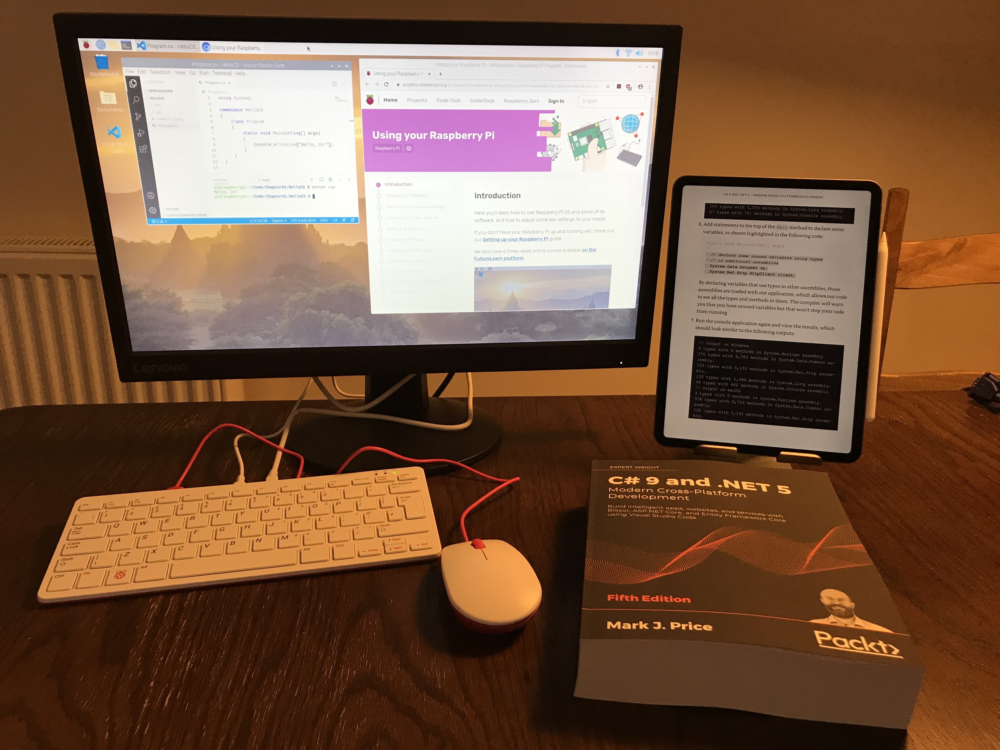
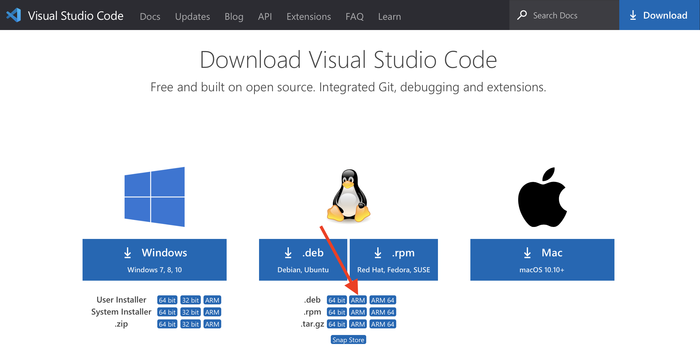
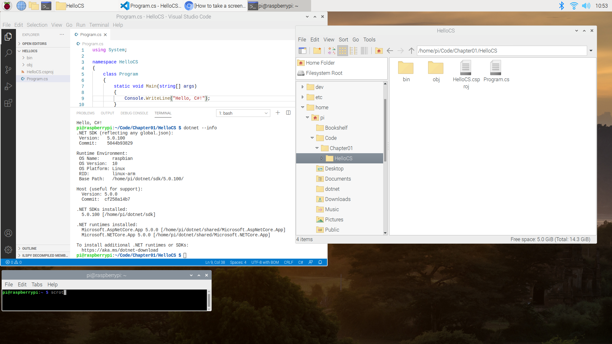

# Using a Raspberry Pi 400 with its 32-bit OS

## Easy As Pi
[Raspberry Pi 400](https://www.raspberrypi.org/blog/raspberry-pi-400-the-70-desktop-pc/) was launched on 2 November 2020. The Raspi has been around for ages but this is the first time its been embedded in a keyboard. A desktop PC capable of learning C# and .NET on for $70? Yes, please!

Since I like life to be as easy as possible, I ordered the $99 model with all the useful extras like power adapter, mouse, and HDMI cable. All I needed to add was a monitor so I also bought a cheap Lenovo LCD.

## About the OS
Raspberry Pi OS is the official supported operating system but it is 32-bit even though the CPU is a quad-core Cortex-A72 (ARM v8) 64-bit SoC @ 1.8GHz and 4GB of RAM.

In a separate article I explain how to set up [Ubuntu Desktop 64](../raspberry-pi-ubuntu64/README.md) if you want to use that instead.

## Setting it up
After connecting everything, Raspberry Pi OS starts and walks you through setting up language choices and so on. If you need help, the Pi website has good [instructions](https://projects.raspberrypi.org/en/projects/raspberry-pi-setting-up/4).

## Installing Microsoft Visual Studio Code
1. Start the Chromium browser.
2. Navigate to https://code.visualstudio.com/download
3. Raspberry Pi OS is based on Debian and is 32-bit, so underneath the main icons for Linux, in the **.deb** row, click the **ARM** button, as shown in the following screenshot:

4. Run the downloaded file.

## Coding with Visual Studio Code

1. From the desktop, click the Raspberry icon in the top-left corner.
2. Navigate to **Accessories** | **Visual Studio Code**.

If you follow the instructions in my book then you will create a folder named Code in your working folder and then create subfolders for each chapter.

You can see operating system and .NET information by entering the `dotnet --info` command in Terminal, as shown in the following screenshot:

## Limitations
Currently the C# extension cannot provide IntelliSense as you type. This is because it uses the OmniSharp language service and that is not (yet) compatible with ARM. 

This means that as you type code, you won't get any help with suggestions. But *real* programmers don't need IntelliSense, right? ;-)

Sadly, you also won't be able to use debugging tools or get help from the MSBuild project extension either, as shown in the following screenshot:

I will update this section as support is added.