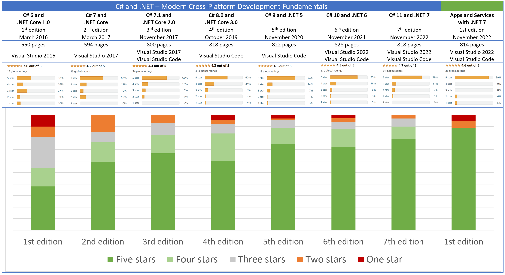

**Seven Years of Ratings**

The first edition of my book was published in March 2016. March 2023 is the seventh anniversary, and the current seventh edition now has enough global ratings, so I thought now would be a good time for a retrospective of how readers rate the seven editions (and first edition of the companion book) published so far and how I have worked hard and responded to feedback to improve the book with each edition. 

# 1st edition

I could see that there was a lot to do to improve the quality of the book and its reception in the market.  

# 2nd edition

A big improvement compared to the 1st edition. Majority of ratings are five stars. No one star ratings.  

# 3rd edition

Incremental improvement compared to the 2nd edition, but it was published only seven months after the 2nd edition so I did not have much time to make improvements. Majority of ratings are five stars. No one star ratings, fewer two-star ratings.  

# 4th edition

A disappointing dip in the number of five-star ratings, balanced by a bigger increase in four-star ratings. Reappearance of some one-star ratings. This was the edition that I stopped using Visual Studio and switched to using Visual Studio Code as much as possible. Some readers were not happy.  

# 5th edition

A nice jump in five-star ratings to over 70%. But another small increase in one-star ratings. My embrace of modern cross-platform tools like Visual Studio Code is polarizing for readers. A super-majority love it; but a small minority hate it. geekette, a five-star reviewer from Australia, said, “He makes you use VS Code (not Visual Studio) which doesn't do as much for you but I found that useful as I now understand more.”

# 6th edition

Regardless of the benefits of Visual Studio Code, I do not want any reader to feel that I make them use a specific coding tool, so I made changes in the sixth edition for readers who want to use Visual Studio or other coding tools to complete the coding tasks in the book. 

# 7th edition

.NET 7 is a Standard Term Support release meaning only 18 months of support from Microsoft. 

# Apps and Services 1st edition

A new companion book. Great ratings for a first edition especially the almost 9 in 10 who give five-stars. But also a few one- and two-star ratings so hopefully responding to feedback and making improvements will help it avoid those in the next edition.

# 8th edition (coming November 2023)
.NET 8 is a Long Term Support release meaning 3 years of support from Microsoft.

# Link to live ratings

If you want to see the latest ratings for all my book editions, the best place to start is my Amazon author page: https://www.amazon.com/Mark-J-Price/e/B071DW3QGN/ 
